# Primeros pasos con CMS-OIE

Este documento presenta una "pequeña" introducción al CMS instalado en las
máquinas virtuales (TestBox, SingleNode, etc.) y sirve como una primera
aproximación a la administración de CMS utilizando alguna de las instalaciones
propuestas. No pretende sustituir a la [documentación de CMS](https://cms.readthedocs.io/en/v1.4/),
sino ser una introducción a nuestra instalación concreta en la que hemos
tomado algunas decisiones de configuración y añadido scripts útiles
que no están disponibles en CMS.

Esos desplegados/instalaciones son, en general, bastante homogéneos de forma
que, obviando las URLs utilizadas, el uso de todas ellas es muy similar. En el
documento asumiremos que se parte de una máquina virtual recién creada
utilizando la opción del ```TextBox```, con la configuración por defecto
propuesta en [su `.env.template`](../TestBox/.env.template). Si no la tienes
aún creada, puedes hacerlo ahora. Para eso entra en el directorio ```TestBox```
y ejecuta ```vagrant up```; si no has creado aún un fichero ```.env``` la
primera ejecución fallará y creará uno por defecto que podrás utilizar en una
segunda ejecución (tienes más detalles sobre el proceso completo en
[la documentación](../README.md)):

```bash
$ cd TestBox

# Lanzamos la primera ejecución que dará un error por no existir el fichero .env;
# se creará una copia de .env.template que podrá
# servir para una primera prueba
$ vagrant up
** ERROR **: Fichero de configuración del desplegado (.env) no encontrado.
Hemos creado uno con el contenido por defecto. Adáptalo y vuelve a ejecutar vagrant up.
Terminamos.
Vagrant failed to initialize at a very early stage:
[...]

# Ahora sí, vagrant montará la máquina. La operación
# tardará unos minutos y generará bastante salida
$ vagrant up
Bringing machine 'default' up with 'virtualbox' provider...
==> default: Importing base box 'ubuntu/bionic64'...
==> default: Matching MAC address for NAT networking...
==> default: Checking if box 'ubuntu/bionic64' version '20210916.0.0' is up to date...
[...]
==> default: Running provisioner: shell...
    default: Running: /tmp/vagrant-shell20231209-9783-1di97uu.sh
    default: Eliminando la posibilidad de sudo sin contraseña al usuario cms
    default: + echo Eliminando la posibilidad de sudo sin contraseña al usuario cms
    default: + grep -v 'cms ALL' /etc/sudoers
    default: + sponge /etc/sudoers
```

Tras el *provisioning* inicial, la máquina quedará arrancada y lista
para ser utilizada. Si todo ha ido bien, CMS tendrá todos los
servicios lanzados en la máquina virtual y estará listo para ser
utilizado. La IP por defecto de la máquina será la 192.168.10.11, a no
ser que se haya indicado una distinta en el ```.env```. En caso de
haber utilizado una opción distinta a ```TestBox``` que tenga varios
nodos/máquinas, habrá varias máquinas lanzadas cada una con una IP
distinta.

## Página de administración

Se puede llegar a la página de administración dirigiendo el navegador
a http://192.168.10.11/admin que presentará la página de login:

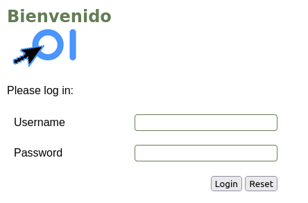

Las credenciales por defecto son ```admin```/```adminCMS``` (¡no
olvidar poner otra distinta en el ```.env```!).

Al entrar se verá el panel de adminstración:

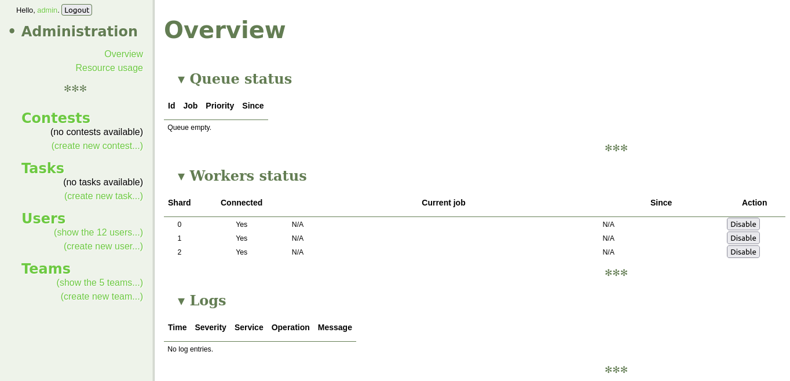

El bloque izquierdo es un menú y el derecho muestra la información
relevante de la opción seleccionada. Algunas cosas que pueden verse en
la parte izquierda:

   - No hay ningún concurso y tarea (problema) dado de alta.
   - Hay 12 usuarios (participantes) registrados (la pista la da el
     texto ```show the 12 users...```). Esto solo ocurrirá si en el
     ```.env``` se indicó que se quería tener soporte para el concurso
     de prueba. Los participantes son personajes de la saga de libros
     de Harry Potter.
   - Hay 5 equipos dados de alta (también únicamente si se indicó
     concurso de prueba). El concepto de equipo en CMS no es el
     habitual en otros concursos (un equipo participa como bloque)
     sino más bien "delegaciones" o "instituciones". Un caso habitual
     en la OIE es que cada equipo sea una regional mientra que en la
     competición internacional cada equipo es un país. En las
     olimpiadas regionales el concepto de equipo puede ser equivalente
     al de centro de estudios. En el caso de los equipos de ejemplo
     instalados, son las distintas casas de Hogwarts de la saga de
     Harry Potter así como el bando de los "villanos".

Por su parte en el panel central se puede ver que:

   - No hay ninguna tarea/envío por evaluar actualmente.
   - Hay lanzados 3 "workers" o jueces en la máquina lo que significa
     que hay tres procesos que podrían evaluar envíos en paralelo. Si
     en la configuración del ```.env```, esta cantidad podría variar.

Si se pulsa la opción ```Resource usage``` del menú lateral aparece la
lista de todas las máquinas responsables de la instancia de CMS
actual. En este caso solo hay una (```localhost```); si se pulsa sobre
ella se puede ver información sobre los recursos consumidos: qué
servicios hay lanzados en ella así como el uso de CPU, memoria y swap
de la máquina.


Algunas cosas que se desprenden de la lista de servicios:

   - Aparecen los tres procesos ```Worker``` que mencionábamos
     anteriormente.
   - El ```ProxyService``` no está lanzado. Eso es lo esperado pues no
     se está actualizando ningún ranking (más sobre esto más
     adelante).
   - El proceso ```AdminWebServer``` es el responsable de la página de
     administrción que estamos viendo.
   - El proceso ```ContestWebServer``` es el responsable del frontend
     de los participantes que veremos más adelante.

Existen otros servicios lanzados que tienen su labor específica pero
que no detallaremos.

## Página de participantes

La página de participantes en este momento es de poca utilidad pues no
hay ningún concurso creado. No obstante, se puede comprobar que,
efectivamente, el ```ContestWebServer``` está funcionando
correctamente dirigiendo el navegador a
http://192.168.10.11/participante/

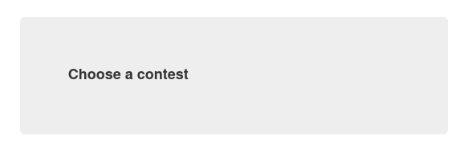

En este momento, como decimos, la página indica que se elija un
concurso pero no aparece ninguno en la lista y por tanto no permite
hacer login (en CMS aunque el login se hace siempre enlazado a un
concurso concreto).

En general CMS puede estar configurado para "atender" a todos los
concursos que haya registrados; por ejemplo si tenemos una competición
con dos o tres concursos como la OIE (un concurso de prueba del
sistema y dos concursos reales cuyos rankings se mezclan), podría
aparecer la lista de los tres concursos posibles de forma que los
usuarios seleccionen para cuál de ellos quieren hacer login.

Como veremos, no obstante, este *no es el comportamiento que
preferimos* pues puede llevar a confusión a los usuarios (además de
mezclar rankings como describimos en otro documento). Por lo tanto
veremos cómo configurar CMS para que solo "atienda" a un concurso.

## Ranking

Si se indicó concurso de prueba, la instalación configura una página
de ranking que tendrá (una vez que se lance) la clasificación. Al
principio, eso sí, mostrará únicamente el logo del concurso y una
tabla vacía con la hora actual. Para verlo se puede ir a
http://192.168.10.11/clasif/ (también está disponible con la URL raiz,
sin ruta, http://192.168.10.11/).

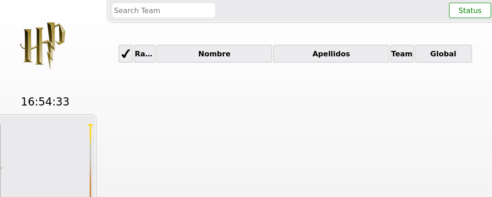

## SSH a la máquina

En este punto podemos acceder por SSH a la máquina para conocer un
poco cómo está la instalación. Parte de la administración de CMS debe
hacerse por consola por lo que es bueno habituarse.

Para la máquina recien creada con Vagrant basta utilizar la capacidad
de Vagrant de conectarse por SSH. Eso sí, de esta forma se utilizará
el usuario del sistema llamado ```vagrant```. Durante la instalación
se ha creado un usuario distinto para administración que es el que
aconsejamos utilizar (y cuya contraseña se configura en el ```.env```,
por defecto ```s3cr3ts3cr3t```). Por lo tanto lo primero que haremos
será cambiar a ese usuario (metiendo la contraseña configurada):

```bash
$ vagrant ssh
Welcome to Ubuntu 18.04.6 LTS (GNU/Linux 4.15.0-156-generic x86_64)
[...]

vagrant@cms-OIE:~$ su cms
Password: 
cms@cms-OIE:/home/vagrant$ cd
cms@cms-OIE:~$ pwd
/home/cms
cms@cms-OIE:~$ 
```

Si se listan los procesos en ejecución (por ejemplo con ```pstree```)
se puede ver que está lanzado ```postgres``` responsable de la base de
datos de CMS, así como los servicios que veíamos en la página de
administración. También aparece un ```cmsRankingWebServer```
responsable de la página de ranking que, por la forma en la que
funciona CMS, no aparecía en la lista de servicios de la web. Una
última cosa a destacar es que la instalación utiliza nginx para
redirigir el tráfico desde las URLs utilizadas anteriormente a los
servicios correspondientes.

```bash
cms@cms-OIE:~$ pstree
systemd─┬─VBoxService───7*[{VBoxService}]
        ├...
        ├─nginx───2*[nginx]
        ├─polkitd───2*[{polkitd}]
        ├─postgres───17*[postgres]
        ├─rsyslogd───3*[{rsyslogd}]
        ├─sh───cmsRankingWebSe───{cmsRankingWebSe}
        ├─sh───cmsAdminWebServ───5*[{cmsAdminWebServ}]
        ├─sh───cmsResourceServ─┬─cmsChecker───10*[{cmsChecker}]
        │                      ├─cmsContestWebSe───5*[{cmsContestWebSe}]
        │                      ├─cmsEvaluationSe───5*[{cmsEvaluationSe}]
        │                      ├─cmsScoringServi───2*[{cmsScoringServi}]
        │                      ├─3*[cmsWorker───{cmsWorker}]
        │                      └─{cmsResourceServ}
        ├─sh───cmsLogService───{cmsLogService}
        ├─...
        └─unattended-upgr───{unattended-upgr}
```

## Concurso de prueba

Para comprobar que todo funciona correctamente, si en el ```.env```
así se indicó la máquina tendrá ficheros para poder simular un
concurso de prueba. La forma de hacerlo es vía SSH desde el directorio
```/home/cms/concurso-prueba```.

Accediendo con el usuario ```cms``` como en el apartado anterior, el
primer paso es dar de alta los problemas y el propio concurso; tras
ello hay que dar de alta a los participantes (Harry Potter, etc.) en
el propio concurso. La instalación habrá dejado un script que se
encarga de hacerlo todo:

```bash
cms@cms-OIE:~$ cd concurso-prueba/
cms@cms-OIE:~/concurso-prueba$ pwd
/home/cms/concurso-prueba
cms@cms-OIE:~/concurso-prueba$ ./registerTestContest.sh 
Compilando ./B-histograma/check/manager.cpp
Compilando ./C-minimo/check/manager.cpp
Compilando ./D-muelles/check/manager.cpp
[...]
AAAA-MM-DD HH:MM:SS.SSS - INFO [<unknown>] Using configuration file /usr/local/etc/cms.conf.
AAAA-MM-DD HH:MM:SS.SSS - INFO [<unknown>] Creating the user's participation in the database.
AAAA-MM-DD HH:MM:SS.SSS - INFO [<unknown>] Participation added.
```

Si en este momento volvemos a la página de administración, veremos que
aparecen las tareas/problemas, así como la existencia del concurso:

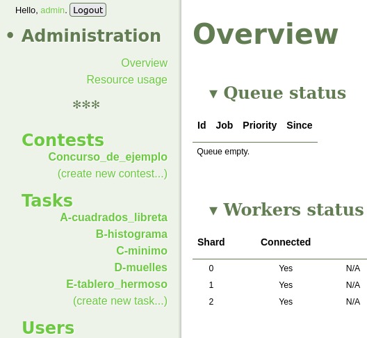

Se puede pulsar sobre el enlace del concurso para ver cómo está
configurado:

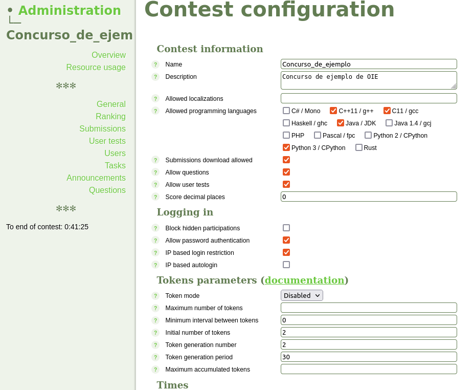

Si nos fijamos en el momento de inicio y fin (no mostrado en la
imagen) veremos que el concurso es de 5 horas de duración y está cerca
del final.

También podemos actualizar la web de acceso a los participantes y
veremos que, ahora sí, en la lista de concursos aparece el que
acabamos de dar de alta y podríamos seleccionarlo y hacer login.

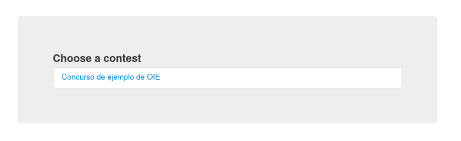

Como decíamos más arriba, este comportamiento *no es el
preferido*. Querremos configurar CMS para que en todo momento solo
tenga un *concurso activo* de forma que a los participantes, cuando se
conecten a la página, les salga directamente la página de login para
el concurso activo y que los rankings reciban únicamente los datos de
un concurso.

Para eso la máquina virtual tiene instalado un script que
(ejecutándose como ```root```) permite activar el concurso
correspondiente dado su *id* numérico (en nuestro caso el 1, pues es
el único que hay; si hubiera otro concurso activo, se deshabilitaría):

```bash
cms@cms-OIE:~/concurso-prueba$ sudo activateContest.sh 1
[sudo] password for cms: 
Deshabilitamos servicios relacionados con el concurso ALL
Removed /etc/systemd/system/multi-user.target.wants/cmsResourceManager@ALL.service.
Habilitamos servicios relacionados con el concurso 1
Created symlink /etc/systemd/system/multi-user.target.wants/cmsResourceManager@1.service → /etc/systemd/system/cmsResourceManager@.service.
```

Una vez hecho esto se puede ver que la web anterior del participante
lleva directamente a la página de login y en la parte superior aparece
el concurso al que se intenta acceder.

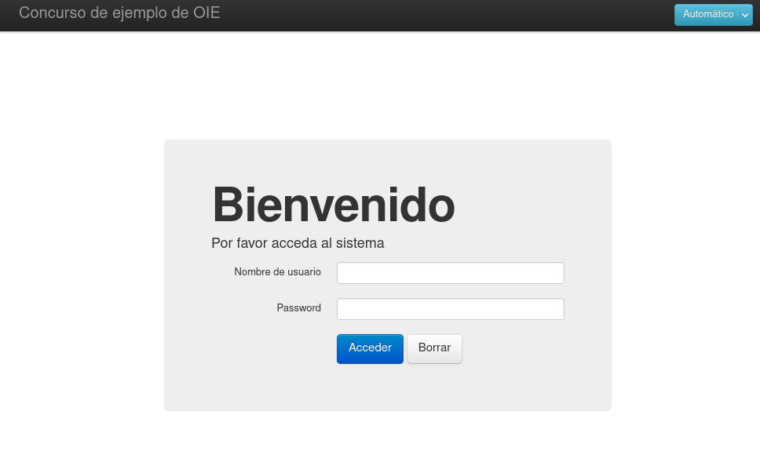

Una vez activado el concurso puede sorprender que el ranking siga sin
reflejar la información asociada. La razón es que las clasificaciones
en CMS son muy versátiles y no están vinculadas a un concurso concreto
automáticamente, sino que se gestionan de forma independiente a
éstos. De hecho, se puede tener más de un ranking para cada concurso o
un único ranking para varios concursos (algo habitual en la OIE donde
la competición consiste en dos concursos celebrados en días
consecutivos con un ranking agregado).

En la instalación de ```TestBox``` se configura un único ranking (con
*id* 1). Si queremos que CMS mantenga esa clasificación actualizada en
base al concurso actual se puede utilizar el script instalado que hace
todo el trabajo de "fontanería" y que, igual que el de activación de
un concurso, debe ejecutarse como ```root```:

```bash
cms@cms-OIE:~/concurso-prueba$ sudo enableRankingUpdates.sh 1
```

En ese momento se puede ir a la página del ranking y se verá que ha
aparecido una fila por participante y una columna por cada
problema. Además hay una penúltima columna que contiene la suma de
puntuación conseguida con los todos los problemas de ese concurso y
una última columna agregada (```Global```) que tendría la suma de
puntuación conseguida en todos los concursos en los que el ranking ha
estado activado:

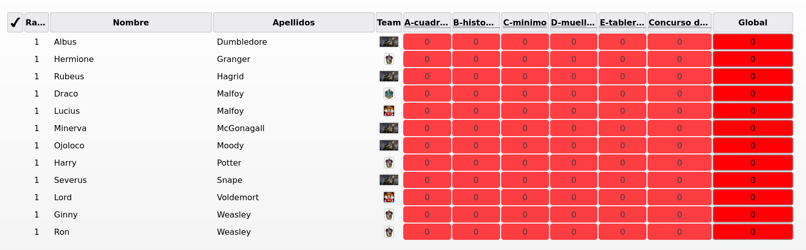

El último paso para comprobar la instalación es simular envíos a ese
concurso. Para eso la instalación con Vagrant ha dejado también en la
máquina algunas soluciones (tanto correctas como incorrectas) y un
script que simula envíos de los distintos usuarios a cada tarea. En
este caso no es necesario ser `root`.

```bash
cms@cms-OIE:~/concurso-prueba$ ./simulateSubmissions.sh
voldemort - C-minimo - XXXXXXXXXX - /home/cms/concurso-prueba/problemas-concurso/C-minimo/sol/solution.cpp
AAAA-MM-DD HH:MM:SS.SSS - INFO [<unknown>] Using configuration file /usr/local/etc/cms.conf.
AAAA-MM-DD HH:MM:SS.SSS - INFO [<unknown>] File 12f2c4a843927cdbaa31aa2940e86314bcfd7cbe 
(Submission file C-minimo.%l sent by voldemort at XXXXXXXXXX.) stored on the database.
[...]
```

En el momento de lanzar la simulación de los envíos, el sistema los
recibirá y comenzará su evaluación. En la página de administración, en
la zona asociada al concurso se pueden ver los envíos y su estado:

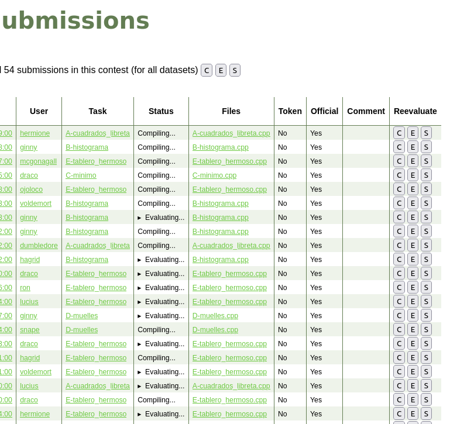

Inicialmente todas estarán en estado "*Compiling...*" e irán
evolucionando poco a poco.

En la página general (*Overview*) se puede también ver el estado de
los workers para comprobar que todos ellos están evaluando envíos
(esto no ocurrirá inmediatamente, sino cuando los envíos simulados
hayan sido compilados):

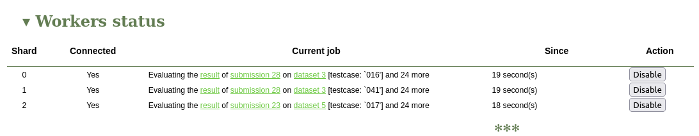

Y también se puede ver la cola de envíos que hay por evaluar y en qué
estado está cada una:


Según va avanzando la evaluación se puede ver cómo el ranking se va
actualizando.


La simulación de los envíos que hace el script se hace de tal forma
que cada envío se simula en un momento concreto del pasado, no en el
momento en el que se ejecuta el script. Eso permite, incluso, que la
simulación de los envíos se haga *una vez terminado el concurso*
(¡!). Se puede curiosear en el ranking y ver cómo ha ido evolucionando
la puntuación de cada participante para ver que los envíos se
"realizaron" durante las 5 horas del concurso en lugar de todas en el
momento de lanzar el script.

La simulación se puede utilizar también como prueba de carga del
sistema. Se puede mirar la página de *Resource usage* para conocer el
uso de CPU, memoria, etc. en un momento de alto número de envíos por
evaluar.

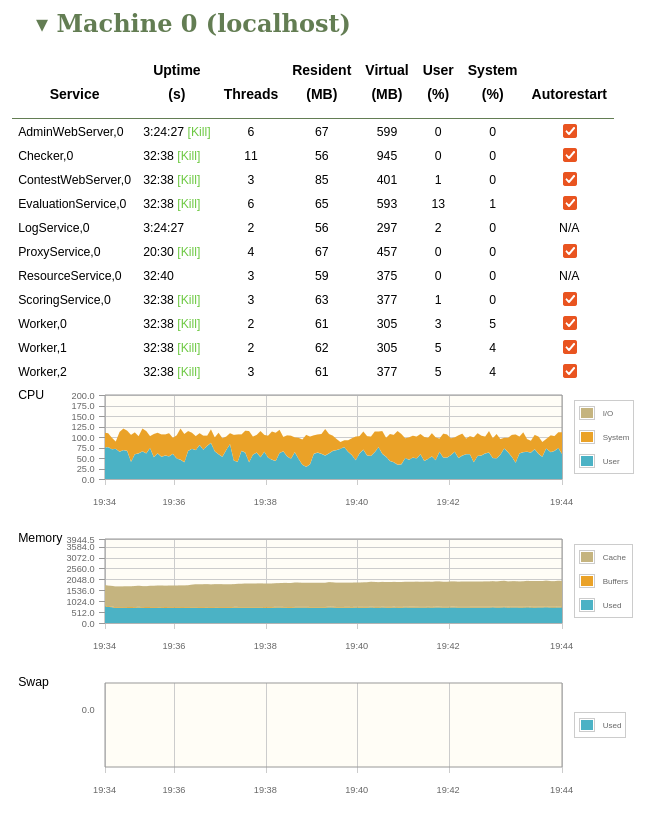

Por último, durante el concurso se puede hacer login como un
participante (con las credenciales por ejemplo
```harry```/```potter```) para ver el interfaz que los concursantes
verán. De hecho una vez lanzado el concurso y hecha la simulación de
los envíos se pueden ver los envíos que "el usuario" que ha hecho (en
realidad que el script ha hecho en su nombre) y cómo evolucionan los
veredictos:

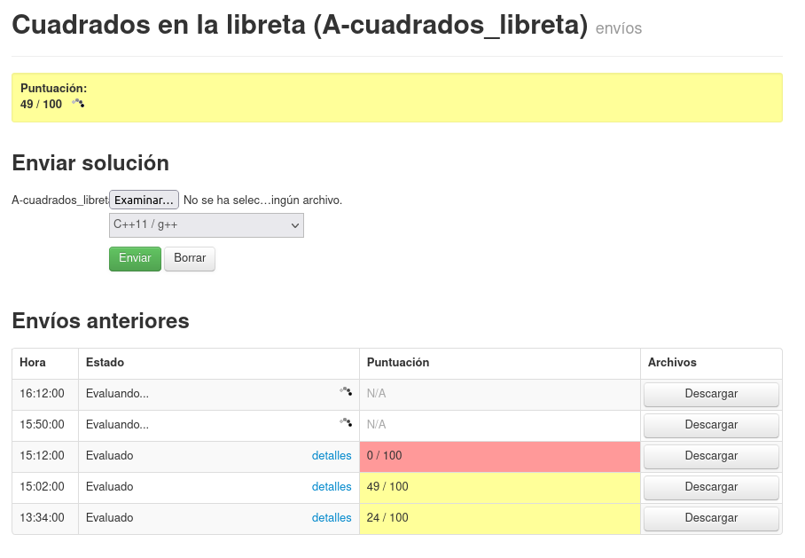

## Diferencias con el resto de opciones de desplegado

El "paseo" descrito antes se ha hecho sobre una máquina limpia
generada con [TestBox](../TestBox/). Los CMS instalados con el resto
de opciones se comportan de una forma muy similar.

### SingleNode

La opción [SingleNode](../SingleNode/) es prácticamente igual que
TextBox. La única diferencia significativa es que en el fichero de
configuración se puede especificar información sobre qué rankings se
querrán tener y durante la construcción se configuran.

Tras la construcción, si se activó el concurso de prueba, se tendrá el
primer ranking configurado para albergar la clasificación de ese
concurso (con el logo de Harry Potter) y el resto lanzados (la web
funciona) pero vacíos.

La forma de acceder a las páginas de administración y participantes es
exactamente igual que en el caso del TestBox y el lanzamiento del
concurso de prueba también.

### MultiNode

La opción [MultiNode](../MultiNode/) tiene varias máquinas virtuales,
de forma que algunos de los servicios están separados y las URLs a
utilizar para acceder a ellos también. En concreto, con la
configuración por defecto del fichero
[.env.template](../MultiNode/.env.template), las URLs serían:

   - Administración: http://192.168.10.14/admin y como en este caso la
     máquina no aloja ningún ranking, también en la dirección raíz,
     http://192.168.10.14
   - Participante: http://192.168.10.14/participante y sin la ruta,
     http://192.168.10.14
   - Ranking: http://192.168.10.12/clasif-test o sin la ruta,
     http://192.168.10.12.


Además en este caso el concurso de prueba hay que hacer las mismas
acciones que en el caso de TestBox sobre la máquina virtual llamada
```main``` (la que contiene la base de datos y los servicios
esenciales de CMS). Además, una vez creado el concurso es necesario
hacer SSH a la máquina con el frontend del participante (```vagrant
ssh contestfrontend```) y activar también el concurso:

```bash
$ vagrant ssh contestfrontend
vagrant@cms-OIE:~$ sudo activateContest.sh 1
```

Hay que hacerlo en ambas máquinas (tanto en ```main``` como en
```contestfrontend```) porque en uno sirve para que los rankings se
actualicen correctamente y en la otra para que la web de los
participantes vaya directa al login del concurso activo.
