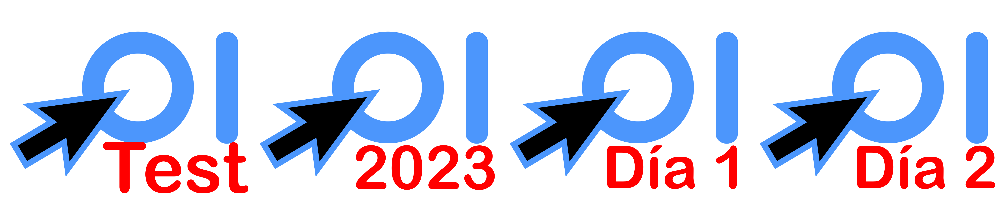

# Roadmap de una competición con CMS-OIE

Sin ánimo de ser exhaustivos, describimos aquí la parte más relevante,
desde el punto de vista del CMS, de la organización de una competición como
la OIE.

En la primera parte se describen los distintos aspectos que se tienen que
tener en cuenta y en el último apartado se hace una pequeña hoja de ruta
sobre los distintos pasos que hay que ir haciendo sobre CMS antes y
durante la competición.

Todo el documento asume la organización de una competición como la OIE,
en la que es habitual que haya hasta tres concursos
distintos: un primer concurso de "*prueba del sistema*" que sirve
para que los participantes conozcan el entorno de competición (laboratorio,
teclado a utilizar, sistema operativo instalado, etc.) y dos concursos
separados cuyas clasificaciones se agregan para conocer al ganador final
de la olimpiada.

## Registro de concursos en CMS

Una misma instalacion de CMS puede utilizarse para organizar distintos
concursos, siempre que estos no sean simultáneos (bueno, quizá siendo
simultáneos también se pueda, pero nuestra instalación y scripts de soporte
no están preparados para ello).

Los concursos están compuestos de una serie de problemas/tareas, un título,
hora de comienzo, etc. Lo más fácil para darlos de alta en el sistema
es hacerlo vía SSH a partir de un .zip con los problemas dados en
"formato italiano" (un formato propio de CMS para definir los problemas)
y un fichero .yml con la información del concurso. Se puede ver un
ejemplo de concurso [aquí](https://github.com/olimpiada-informatica/cms-ejemplo-concurso)
(de hecho es el concurso que se añade en las instalaciones cuando
se configura el concurso de prueba).

El procedimiento sería subir al servidor (o a la máquina
```main``` en instalaciones multinodo) un .zip por cada concurso y utilizar
el script ```addContest.sh``` que se encarga de compilar lo necesario
(checkers y managers) y permite especificar la hora de inicio y fin del
concurso por parámetros. Una descripción exhaustiva del funcionamiento
puede verse [aquí](https://github.com/olimpiada-informatica/cms-utils). A modo
de ejemplo, para crear un concurso que empieza inmediatamente y dura 10
minutos sería:

```bash
# Ejemplo de uso. Concurso que comienza inmediatamente con una duración de 10 minutos
$ ls
MiConcurso
$ ls MiConcurso/
A-cuadrados_libreta  B-histograma  C-minimo  contest.yaml  D-muelles  E-tablero_hermoso
$ addContest.sh MiConcurso/ $(date +%s) 600
```
Cada concurso dado de alta tiene un identificador numérico único que se
utilizará después en los scripts. El identificador puede averiguarse
desde el panel de administración mirando la URL de la página de información
de cada concurso particular.

## Concurso activo

Los distintos servicios de CMS se pueden lanzar para que estén "atentos"
de un concurso específico o de todos los concursos dados de alta.

En nuestro caso querremos que haya siempre un único concurso "activo", pues
si no:

   - A los participantes al ir a hacer login le saldría una lista de todos
   los concursos registrados en el sistema en lugar de ir directamente
   al concurso en curso (o apunto de empezar). Los detalles sobre esto
   (a nivel de usuario) se explican en el documento
   [Primeros pasos con CMS-OIE](./PrimerosPasos.md).
   - El *ProxyServer* que contacta con los rankings enviaría la información
   de todos los concursos activos por lo que en los rankings aparecería
   una columna por cada uno de sus problemas.
      
En realidad, el concepto de concurso activo no aparece en la documentación
de CMS, pero para nosotros es:

   - El único concurso para el que los participantes pueden hacer login.
   - El que vigila el ProxyServer para informar sobre sus cambios a los
   rankings.
   - Del que se preocupa el EvaluationService, ScoringService e incluso
   (en SingleNode) los Workers.

Poco antes del comienzo de cada concurso habrá que activarlo en CMS
utilizando (como root) el script ```activateContest.sh``` seguido del
id del concurso. En instalaciones multinodo esta activación habrá que
hacerla tanto en la máquina ```main``` como en ```contestfrontend```.
El script desactiva el concurso anterior (si lo había) y activa el nuevo.

## Registro de participantes

En una competición como la OIE a los participantes se les debe dar, en el
momento de comenzar el concurso, las credenciales de acceso a CMS. Es importante
que estas credenciales *no* las conozcan de antemano para evitar
comportamientos fraudulentos (participantes compartiendo contraseñas
entre ellos o incluso con terceros que puedan acceder a los problemas y
hacer envíos desde fuera en nombre de los participantes).

Por eso es importante que entre un concurso y otro **se cambien las
contraseñas** de los participantes. Lamentablemente esto *no* puede hacerse
de forma automática sino que requiere hacerse manualmente navegando por
el panel de administración. En una competición con un único concurso
de prueba y un concurso real (como típicamente pueden tener las
regionales) esta labor se evita si por cada participante se crean *dos*
usuarios en CMS, uno para cada concurso.

Para la OIE, no obstante, eso no es suficiente. Como el resultado global
de la competición consiste en agregar los resultados parciales de 
dos concursos, los usuarios de CMS utilizados por cada participante en
ellos tiene que ser el mismo. Lo aconsejado pues será:

   - Que cada participante tenga un usuario para ser utilizado en
   la sesión de prueba del sistema.
   - Que cada participante tenga un usuario (con nombre y contraseña
   distintos) para ser utilizado en los concursos que marcan el resultado
   de la competición. En este caso tocará cambiar (a mano) la contraseña
   entre uno y otro utilizando el panel de administración.

Lo mejor es tener, entonces, una hoja de cálculo [similar a esta](https://docs.google.com/spreadsheets/d/1DNZ4kaNdbEPauDCkgZ28x01FDKPuLsbMpns1tRb0k-o/). Esa hoja permite generar
.json con la información de equipos/países/regiones y otro con la lista de
participantes de forma uqe pueden crearse los usuarios de CMS utilizando
los scripts ```registerTeams.sh``` y ```registerUsers.sh``` (descritos
[aquí](https://github.com/olimpiada-informatica/cms-utils)).

En la hoja con la información de usuarios del concurso real deberá haber,
además, una columna extra con las contraseñas del segundo concurso que
habrá que actualizar a mano.

Con todo lo anterior se registran los usuarios *en CMS* para que puedan
hacer login, pero queda un paso adicional que es registarlos en los
concursos particulares. Si no, el usuario podrá hacer login pero no
conectarse al concurso y hacer envíos. Para eso se utiliza el script
```registerParticipation.sh```.

# Rankings

Los rankings dan mucho juego en una competición como la OIE. El soporte
de CMS permite hacer cosas más o menos sofisticadas (ver una explicación
[aquí](./Rankings.md)). En una competición como la OIE se pueden tener
los siguientes:

   - Ranking para el concurso de prueba del sistema. Se puede congelar a falta
   de una hora para probar que todo funciona :)
   - Ranking público para el día 1 cuya actualización se congela a falta
   una hora del final.
   - Ranking para el día 2 cuya actualización se congela también a una hora.
   - Ranking agregado de los dos días en donde la actualización se congela
   de la misma forma que los anteriores. De esta forma, al final del
   segundo día tendrá la información parcial agregada con la suma de los
   puntos conseguidos por los participantes ambos días en el momento de
   congelar el marcador.
   - Ranking interno agregado de ambos días que no se congela, para que
   desde la organización se conozca en todo momento la puntuación real
   agregada de los participantes.

Todos esos rankings (a excepción, quizá, del último) estarán en la
máquina ```main```, tendrá cada uno un id numérico interno y una URL
de acceso que no tiene por qué hacerse pública. Si se piensa
con la anticipación suficiente, los rankings pueden crearse desde el
principio gracias a los ```.env``` o construirse a posteriori tal y
como se explica en [el documento sobre rankings](./Rankings.md). Se haga
en el momento que se haga, se debe tener claro qué id pertenece a cada
ranking. Por ejemplo, para la OIE'2023 se tenía algo así:

| Id | Ruta | Tipo de ranking |
|----|------|-------------------|
| 1 | /test | Prueba del sistema |
| 2 | /oie-dia-1 | Concurso público día 1 (se congela antes de terminar) |
| 3 | /oie-dia-2 | Concurso público día 2 (se congela antes de terminar) |
| 4 | /oie2023 | Concurso agregado parcial (suma de los dos anteriores) |
| 5 | /ruta-secreta | Concurso interno agregado sin congelar |

Aunque en la lista se ha hablado de que algunos son "rankings públicos"
eso no significa que sus rutas tengan que anunciarse. Lo más cómodo
(para los participantes y espectadores) es que la URL raíz de la máquina
se vaya cambiando para que en cada momento apunte al ranking de interés en
ese momento de la competición. Por ejemplo, en la OIE'2023 el ranking
estaba siempre en https://ranking.juezonline.com que mostraba uno u otro
dependiendo del momento concreto. Con esta idea, se tendría:

   - Antes de comenzar la sesión de prueba se publica en el raíz
   el ranking de prueba del sistema. En el momento de comenzar el concurso
   se habilita su actualización. Es importante no habilitar la actualización
   antes (tanto en este como en los demás concursos) pues cuando se habilita
   CMS envía a los rankings los problemas por lo que se conocería con
   antelación tanto el número de problemas como sus títulos.
   - A mitad del concurso de prueba, se deshabilita la actualización para
   "congelar" el ranking. Esto no pretende dar emoción al concurso sino
   que sirve para comprobar que la congelación funciona :)
   - Tras el concurso de prueba, en la sesión posterior en el salón de
   actos donde se hace el *post-mortem* de la sesión, se descongela la
   actualización para mostrar el resultado final.
   - Antes del primer concurso se publica en el raíz su ranking. En el
   momento en el que comienza se
   habilita la actualización tanto de él como del agregado y del interno.
   - A las tres horas del concurso se deshabilita la actualización del
   ranking del concurso y del agregado (pero se mantiene la actualización
   del interno).
   - Antes del segundo concurso se publica en el raíz su ranking. Cuanod
   comienza se
   habilita la actualización tanto de él como del agregado. La
   actualización del interno nunca se deshabilitó, así que no hay que
   hacer nada con él.
   - A las tres horas del concurso se deshabilita la actualización del
   ranking del concurso y del agregado (pero se mantiene la actualización
   del interno).
   - Poco antes del comienzo de la entrega de premios se puede poner en
   el raíz el ranking agregado parcial que contiene la suma de las puntuaciones
   hasta la congelación del marcador. Durante la entrega de premios,
   antes de desvelar los ganadores se puede mostrar al público. Este ranking
   no muestra información desconocida, obviamente, pero sí información que
   es difícil conseguir a no ser que se hayan ido guardando las puntuaciones
   de cada concurso.
   - Tras desvelar los ganadores se puede volver al ranking descongelado
   y habilitar su actualización para ver el ranking final. Esto en la OIE 2022
   lo intentamos pero lo hicimos mal (solo habilitamos la actualización
   del concurso del día 1). Si se hace bien, queda resultón.

Es importante que el momento de inicio del concurso coincida con la
habilitación de las actualizaciones de los rankings y que la congelación
se haga en el momento en el que se cumplen las tres horas (o lo que se
estipule). Para eso lo mejor es planificar estas activaciones/desactivaciones
con ```cron``, de forma que no haya que estar atentos a hacerlo de
forma manual durante el concurso. Eso sí, si por alguna razón el
concurso comienza con retraso *se debe recordar cambiar las horas del cron*.

## Fotos y "banderas" en los ranking

Cada ranking tiene un directorio independiente con los datos, fotos y
banderas. Lo ideal es que:

   - Durante el registro se instale un *photocall* en el que se haga una
   foto a cada participante.
   - Cada una de las fotos (con aspect ratio 2:3) se renombra para que
   tenga el nombre del usuario de CMS que utilizará esa persona.
   - Para cada ranking se sube, utilizando ```addRankingImages.sh```
   (descrito [aquí](https://github.com/olimpiada-informatica/cms-utils))
   las fotos y banderas. Se puede, además, poner un logo personalizado
   de cada concurso, por ejemplo que ponga "OIE 2023 Día 1" o lo que sea.
   A continuación aparecen los logos utilizados en la OIE 2023.

   


# Hoja de ruta de una competición

A modo resumen, listamos aquí cada uno de los pasos que hay que hacer
según lo descrito más arriba. Conviene que los organizadores del concurso
adapten esta lista a sus necesidades y la tengan en algún sitio preparada
con antelación para no olvidar nada, especialmente en las acciones manuales
que hay que hacer los días de la competición.

Para esta hoja de ruta asumimos una competición que:

   - Recibe a los participantes el sábado por la mañana; en el momento
   del registro se tiene el *photocall*.
   - Durante el acto de inauguración se procesan las fotos y se ordenan
   para poder subirlas a CMS.
   - El mismo sábado antes de comer se hace el concurso de prueba del sistema.
   - El sábado por la tarde tiene lugar el primer concurso (concurso del
   "día 1").
   - El domingo por la mañana se celebra el segundo concurso (concurso del
   "día 2").
   - Después de comer se hace la entrega de premios.

## Preparación de rankings

Si no se hizo en el momento de crear las máquinas virtuales, tocará
pensar qué rankings se quieren y sus rutas y crearlos tal y como se
describe en [el documento sobre rankings](./Rankings.md).

En lo que sigue asumimos los siguientes rankings:

| Id | Ruta | Tipo de ranking |
|----|------|-------------------|
| 1 | /test | Prueba del sistema |
| 2 | /oie-dia-1 | Concurso público día 1 (se congela antes de terminar) |
| 3 | /oie-dia-2 | Concurso público día 2 (se congela antes de terminar) |
| 4 | /oie2023 | Concurso agregado parcial (suma de los dos anteriores) |
| 5 | /ruta-secreta | Concurso interno agregado sin congelar |

Para que no se "estropeen" con datos temporales de concursos de prueba,
aconsejamos deshabilitar su actualización

```bash
cms@cms-OIE:~$ sudo disableAllRankingUpdates.sh
```

## Preparación de concursos

El equipo de problems-setters hará llegar los problemas tanto de la sesión
de pruebas como de los dos días de concurso. Hay que subirlos a la máquina
```main```, los descomprimimos en algún directorio temporal y los
subimos a CMS:

```bash
cms@cms-OIE:~$ cd
concurso-dia1 concurso-dia2 concurso-test
cms@cms-OIE:~$ addContest.sh concurso-test
[...]
cms@cms-OIE:~$ addContest.sh concurso-dia1
[...]
cms@cms-OIE:~$ addContest.sh concurso-dia2
[...]
```

Se puede añadir como parámetros el timestamp de la hora de comienzo, ponerla
en el .yml o cambiarla en la página de administración.

Tras el registro de los concursos hay que fijarse en los identificadores
numéricos, que se utilizarán más abajo. Para los ejemplos asumiremos:

| Concurso | Id |
|-|-|
| test | 14 |
| dia 1 | 15 |
| dia 2 | 16 |

## Registro de usuarios

Se debe subir el .json de los equipos y de los usuarios. Como se explicó antes
de los usuarios habrá dos, uno para la sesión de test y otro para los
dos concursos.

Tras eso:

```bash
cms@cms-OIE:~$ cd
teams.json users-test.json users-concurso.json
cms@cms-OIE:~$ registerTeams.sh teams.json
[...]
cms@cms-OIE:~$ registerUsers.sh users-test.json
[...]
cms@cms-OIE:~$ registerUsers.sh users-concurso.json
[...]
```

Con esto tendremos los usuarios dados de alta en el CMS. Queda ahora
añadirlos a los concursos concretos:

```bash
cms@cms-OIE:~$ cd
teams.json users-test.json users-concurso.json
cms@cms-OIE:~$ registerParticipation.sh 14 users-test.json
[...]
cms@cms-OIE:~$ registerParticipation.sh 15 users-concurso.json
[...]
cms@cms-OIE:~$ registerParticipation.sh 16 users-concurso.json
[...]
```

## Planificación de activaciones/desactivaciones de rankings

En el fichero ```/etc/crontab``` se puede planificar la activación/desactivación
de los rankings. En la OIE 2023 las fechas y horas de los concursos fueron:

| Concurso | Día | Inicio | Congelación |
|-|-|-|-|
| Test | 25/3 | 12:00 | 13:00 |
| Día 1 | 25/3 | 15:00 | 18:00 |
| Día 2 | 26/3 | 9:30 | 12:30 |

Con este calendario lo que se añadió en el ```crontab``` fue:

```
#########
# OIE 2023
#########

# Prueba del sistema
00 12   25 3 *  root    enableRankingUpdates.sh 1
00 13   25 3 *  root    disableRankingUpdates.sh 1

# Concurso dia 1
00 15   25 3 *  root    (enableRankingUpdates.sh 2; enableRankingUpdates.sh 4; enableRankingUpdates.sh 5)
00 18   25 3 *  root    (disableRankingUpdates.sh 2; disableRankingUpdates.sh 4)

# Concurso dia 2
30 9    26 3 *  root    (enableRankingUpdates.sh 3; enableRankingUpdates.sh 4)
30 12   26 3 *  root    (disableRankingUpdates.sh 3; disableRankingUpdates.sh 4)
```

Es **importante** que todas las activaciones/desactivaciones que ocurren
a la misma hora se planifiquen en una única línea, en lugar de en varias
líneas con la misma hora de comienzo. En caso contrario el demonio podría
lanzarlas todas a la vez algo para lo que los scripts no están preparados
(podrían pisarse unos a otros el fichero de configuración). No queréis saber
cómo nos dimos cuenta de esto... ':-)

# Viernes noche (o sábado por la mañana)

Activar el concurso de test tanto en ```main``` como en ```contestfrontend```.

```bash
# Ejecutarlo en main y en contestfrontend
cms@cms-OIE:~$ sudo activateContest.sh 14
```

En ```main``, además, publicar el ranking 1 en la URL raíz cambiando
el fichero ```/etc/nginx/sites-available/cms-endpoints/root.conf``` y
luego relanzando con ```sudo service nginx restart```

# Sábado mañana, durante el acto de bienvenida

Tras organizar las fotos con el formato descrito [aquí](https://github.com/olimpiada-informatica/cms-utils):

```bash
# Ejemplo de uso
cms@cms-OIE:~$ ls
faces  flags  logo.png  teams.json  users.json
cms@cms-OIE:~$ addRankingImages.sh /home/cms/rankings/ranking1
cms@cms-OIE:~$ addRankingImages.sh /home/cms/rankings/ranking2
cms@cms-OIE:~$ addRankingImages.sh /home/cms/rankings/ranking3
cms@cms-OIE:~$ addRankingImages.sh /home/cms/rankings/ranking4
cms@cms-OIE:~$ addRankingImages.sh /home/cms/rankings/ranking5
```

Si se han hecho logos distintos para cada ranking se pueden copiar a mano
al directorio del ranking.

Tras los cambios es posible que haya que relanzar los *RankingWebServer*
para actualizar sus cachés (principalmente del logo). Usa ```ps``` para
ver los que hay en ejecución y relanzalos.

# Sábado durante el concurso de test

- Al principio, comprobar que se ha activado la actualización del ranking.
- En la parte final, comprobar que se ha desactivado. Se puede mirar
el fichero de configuración

# Sábado, durante la comida

Activar el concurso del día 1 tanto en ```main``` como en ```contestfrontend```.

```bash
# Ejecutarlo en main y en contestfrontend
cms@cms-OIE:~$ sudo activateContest.sh 15
```

En ```main``, además, publicar el ranking 2 en la URL raíz cambiando
el fichero ```/etc/nginx/sites-available/cms-endpoints/root.conf``` y
luego relanzando con ```sudo service nginx restart```

# Sábado durante el concurso del día 1

- Al principio, comprobar que se ha activado la actualización de todos los
rankings (el del día 1, el agregado y el interno).
- En la parte final, comprobar que se han desactivado el del día 1 y el
agregado. Se puede mirar el fichero de configuración.

# Sábado noche

**Cambiar a mano las contraseñas de los participantes**

Activar el concurso del día 2 tanto en ```main``` como en ```contestfrontend```.

```bash
# Ejecutarlo en main y en contestfrontend
cms@cms-OIE:~$ sudo activateContest.sh 16
```
En ```main``, además, publicar el ranking 3 en la URL raíz cambiando
el fichero ```/etc/nginx/sites-available/cms-endpoints/root.conf``` y
luego relanzando con ```sudo service nginx restart```

# Domingo durante el concurso del día 2

- Al principio, comprobar que se ha activado la actualización de todos los
rankings (el del día 2 y el agregado).
- En la parte final, comprobar que se han desactivado el del día 2 y el
agregado. Se puede mirar el fichero de configuración.

# Domingo tras el concurso

Configurar nginx para que la URL raíz apunte al ranking agregado (congelado).

# Durante la entrega de premios

Tras desvelar los ganadores se puede actualizar en directo el marcador final.
Se muestra en el proyector y desde una consola en ```main```, se activa
el concurso 15 (el del día 1) y se habilita la actualización del ranking 4.
En ese momento la página cambiará recogiendo los puntos conseguidos durante
la congelación del marcador del día 1. Cuando esté, se activa el
concurso 16 (el del día 2) y el ranking se actualizará con esos nuevos datos.

Al final, el ranking tendrá el resultado final de la competición.
